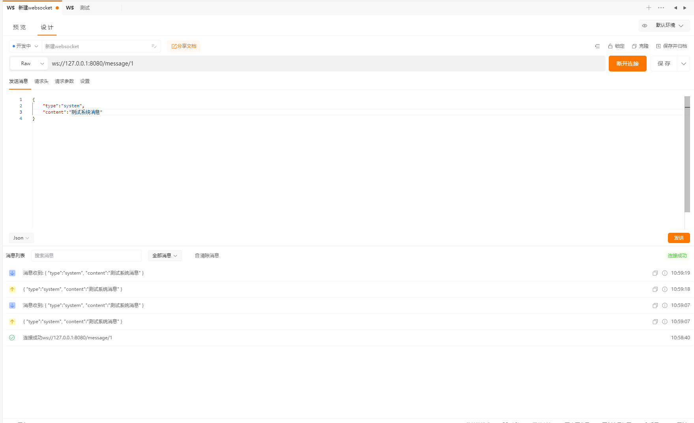
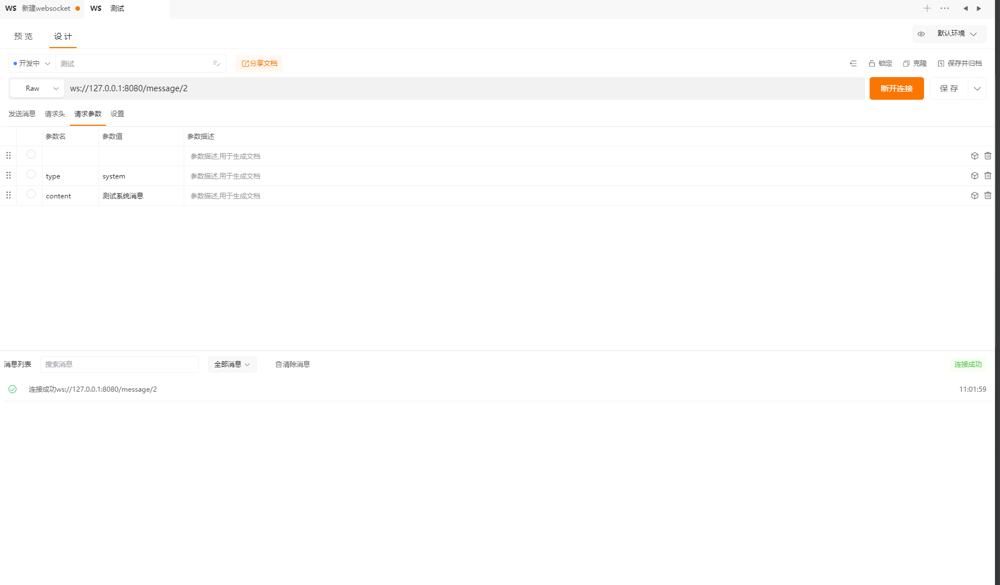

# java-note
java-学习笔记

## spring-boot整合 websocket

效果实现

日志输出

~~~ java
2023-09-03 10:58:40.166  INFO 19704 --- [nio-8080-exec-1] o.a.c.c.C.[Tomcat].[localhost].[/]       : Initializing Spring DispatcherServlet 'dispatcherServlet'
2023-09-03 10:58:40.166  INFO 19704 --- [nio-8080-exec-1] o.s.web.servlet.DispatcherServlet        : Initializing Servlet 'dispatcherServlet'
2023-09-03 10:58:40.167  INFO 19704 --- [nio-8080-exec-1] o.s.web.servlet.DispatcherServlet        : Completed initialization in 1 ms
2023-09-03 10:58:40.203  INFO 19704 --- [nio-8080-exec-1] o.e.service.GMessageListenerService      : 【1:0】用户进入, 当前连接数：1
2023-09-03 10:59:07.320  INFO 19704 --- [nio-8080-exec-3] o.e.service.GMessageListenerService      : 接受到消息{
    "type":"system",
    "content":"测试系统消息"
}
2023-09-03 10:59:07.357  INFO 19704 --- [nio-8080-exec-3] o.e.service.GMessageListenerService      : 解析的内容:system
2023-09-03 10:59:07.357  INFO 19704 --- [nio-8080-exec-3] o.e.service.GMessageListenerService      : 解析的内容:测试系统消息
2023-09-03 10:59:07.362  INFO 19704 --- [nio-8080-exec-3] o.e.service.GMessageListenerService      : 解析之后转换:SystemMessage()
2023-09-03 10:59:19.077  INFO 19704 --- [nio-8080-exec-2] o.e.service.GMessageListenerService      : 接受到消息{
    "type":"system",
    "content":"测试系统消息"
}
2023-09-03 10:59:19.078  INFO 19704 --- [nio-8080-exec-2] o.e.service.GMessageListenerService      : 解析的内容:system
2023-09-03 10:59:19.078  INFO 19704 --- [nio-8080-exec-2] o.e.service.GMessageListenerService      : 解析的内容:测试系统消息
2023-09-03 10:59:19.078  INFO 19704 --- [nio-8080-exec-2] o.e.service.GMessageListenerService      : 解析之后转换:SystemMessage()

2023-09-03 10:59:19.078  INFO 19704 --- [nio-8080-exec-2] o.e.service.GMessageListenerService      : 解析的内容:system
2023-09-03 10:59:19.078  INFO 19704 --- [nio-8080-exec-2] o.e.service.GMessageListenerService      : 解析的内容:测试系统消息
2023-09-03 10:59:19.078  INFO 19704 --- [nio-8080-exec-2] o.e.service.GMessageListenerService      : 解析之后转换:SystemMessage()
2023-09-03 11:01:59.588  INFO 19704 --- [nio-8080-exec-4] o.e.service.GMessageListenerService      : 【2:1】用户进入, 当前连接数：2
~~~